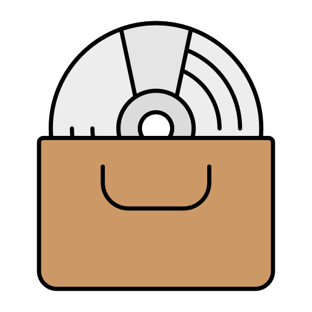

# Crate.

Crate. is an online community where vinyl enthusiasts can share their love for music with others.

<br />

## Wireframes
[](https://www.figma.com/file/ctUsUnXEsvyS0d88qSz9oP/Crate.?node-id=0%3A1)

<br />

## Built With
This project was built with the following:
- [React](https://reactjs.org/)
- [Ruby](https://www.ruby-lang.org/en/)
- [Sinatra](http://sinatrarb.com/)
- [Active Record](https://guides.rubyonrails.org/active_record_basics.html)
- [Material UI](https://mui.com/) (CSS)

<br />

## Getting Started
To run this project locally, install and launch the backend server <a href="https://github.com/Jblengino510/phase-3-project-backend">here</a>.  After you get the backend started, run these commands in your CLI to get the frontend started:
<br />

```javascript
npm install
npm start
```

## User Stories
- Login or sign up for an account
- Post their favorite vinyl albums
- Edit a previous post
- Delete a previous post

<br />

## Stretch Goals
- Add more styling
- Add ability to like a post
- Add ability to comment on a post and reply to another comment
